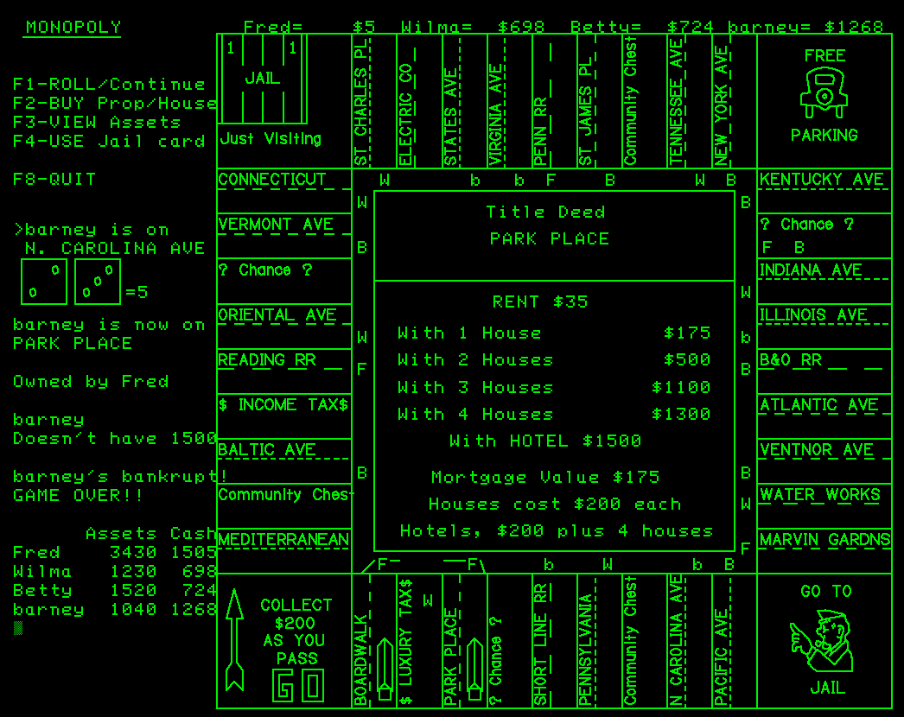

# Tektronix-4051-Emulator



Based on the original ***Tektronix 405x Javascript Emulator*** by Dave Roberts and enhanced by Jon Stanley found here:
https://github.com/jonbstanley/Tek405xEmulator

plus many enhancements by Twilight-Logic in his fork here:
https://github.com/Twilight-Logic/Tek405xEmulator

---

# Table of Contents

- [Table of Contents](#table-of-contents)
- [Release NOTES](#release-notes)
- [Installation and Running the 4051 Emulator](#installation-and-running-the-4051-emulator)
- [Flash Drive directories tested to work on the 4051 Emulator](#flash-drive-directories-tested-to-work-on-the-4051-emulator)
- [4051 Manuals](#4051-manuals)
- [Features](#features)
- [History](#history)
- [Feature Requests](#feature-requests)

# Release NOTES

**January 6, 2025**
- updated Flash Drive zip to January 6, 2025
  - updated MAIN MENU to add SimpleDemo and Michelangelo
  - added SimpleDemo for VintageTEK and other exhibitors to easily demo Mickey Mouse, Death Star and INSTANT ART
  - added Michelangelo to view vector image ported from Commodore Plus/4 BASIC
  - added 6800 Disassembler program and example source from Application Library tape
  - added MENU to SVG2FG to view and select from list of SVG files
  - updated EM Benchmark to compare with my 4051 benchmark results in 1979

# Installation and Running the 4051 Emulator

- **Tektronix-4051-Emulator** requires a computer with at least 1024x800 graphics monitor and Chrome or other HTML5 web browser

- Download and unzip the 4051-Emulator zip file
- Download and unzip the FlashDrive zip file
- Run the 4051 Emulator by running the jsTEKTRONIX4051_universal.html file in the unzipped 4051 Emulator folder
- Your computer default web browser will launch the 4051 Emulator in a new tab
- Click the "!!mute button", then Click the "start" button at the bottom of the screen to start the 4051 emulator
- Click the "storage" button at the bottom of the emulator screen
  - select "4050 Flash Drive files" in the pulldown next to the Import button
- Click the "Import" button and click OK on the warning popup
  - use the computer file explorer pop-up window to navigate to the desired unzipped Flash Drive directory (ex: Games)
  - Click on the first file and press Shift and End keyboard keys to select all files in the directory and press Enter
  - Click "Close" on the Done popup window
  - Click "Cancel" on the storage window
- Click the "Auto Load" button on the 4051 Emulator
- This will load and run file 1 in this directory which is typically a menu program

PC Keyboard key mapping:

- USER DEFINABLE - the ten Tektronix user definable keys below the display window are mapped to F1-F10 keys on a PC or MAC, or you can click the keys on the emulator window
- LINE EDITING - to correct a typing error press keyboard "backspace" and type your correction or use the Line Editor keys in the emulator window
- HOME/PAGE - When the display shows blinking "F" in the top left corner, you must clear the screen by pressing the HOME/PAGE key on the window or the keyboard "home" key
- RUB OUT - Mapped to keyboard "delete" key or press RUB OUT on the emulator window
- BREAK - not mapped to the keyboard, press this key on the emulator window once or twice to stop a program 


# Flash Drive directories tested to work on the 4051 Emulator

NOTES:
1. To run a program in a different Flash Drive directory:
   - press "storage" to open storage window, press "DelALL" to clear all the files, then "Import" to load different Flash Drive directory files.
   - press "Cancel" to close storage window and select "Auto Load" in the emulator window or manually type the commands in NOTE 2 where X=1
3. To run an individual program number loaded into storage, type the following commands into the emulator window replacing X with the program number:
   ```
   FIND@5:X
   OLD@5:
   RUN
   ```

- **BMP**
  - my 4050 Bitmap pictures (press home keyboard key to clear the picture after picture is displayed then RUN to rerun the menu program)
- **Games**
  - Game files 2-6, 10-26 and 28-30 were written by Tektronix and found on various 4050 tapes
  - Game 6 is actually "Super Artillery" written by Tektronix
  - Game 7 was written by the Tektronix author of the Fast Graphics/R12 ROM Pack
  - Game 9 was a Tektronix Star Trek that I edited to add Function Key mode and graphical phaser and photon torpedo shots
  - Game 27 Game of LIFE and 31 Master Mind were written by me in the late 1970's from articles in Byte and other magazines of the time
  - Game 36 Minesweeper is my port from a Tiny BASIC game
- **GrpR12demo**
  - R12 Graphics Demo tape files.  R12 MUSIC and SOUND commands do not play on the 4051 Emulator yet
- **MONOPOLY**
  - My MONOPOLY game (screenshot in this README) [Monopoly Instructions](https://github.com/mmcgraw74/Tektronix-4051-4052-4054-Program-Files/tree/master/Games/Monopoly)
- **Pictures**
  - Pictures 1-27 were on the R12 demo tape or the 4051 Fast Graphics demo tape. I created 28-35
- **R12IceRace**
  - My port of Option 30 Ice Race to 4051 R12 game.
- **SVG2FG**
  - My SVG to Fast Graphics R12 line drawings.  I recommend selecting multiple pictures (2) as there is no menu yet


# 4051 Manuals

[4050 Operators Manual](http://www.bitsavers.org/pdf/tektronix/405x/070-1940-01_4050_oper_Mar80.pdf)

[4050 BASIC Reference](http://www.bitsavers.org/pdf/tektronix/405x/070-2056-01_4050_ref_Jul79.pdf)

More 4050 manuals including option ROM manuals are here: 
[Bitsavers Tektronix 405x manuals](http://www.bitsavers.org/pdf/tektronix/405x/)

# Features

I renamed this project Tektronix 4051 Emulator, since it is limited to emulating the Tektronix 4051 hardware:
- Motorola 6800 CPU with 800KHz clock
- 32KB of RAM
- 32KB of Tektronix 4050 BASIC ROM
- 1024x780 vector graphics resolution

Twilight-Logic added several features to the original 405x Emulator including:

- **All 4051 Option ROMs!**
  - 4051R01 Matrix Functions
  - 4051R05 Binary Program Loader
  - 4051R06 Editor
  - 4051R07 Signal Processing I
  - 4051R08 Signal Processing II
  - 4051R12 Graphics Enhancement
  - 4051R14 GPIB Enhancement
  - 4051 DDT51.8 6800 Assembly language Debugger
  - 4051 Extended BASIC
  - 4051 Extended Fonts
- **Flash Drive - Mass Storage**
  - Emulates an external Tektronix 4924 GPIB Tape Drive 
    - Multiple Flash Drives allow one file open on each drive for multiple reads or writes
    - Huge files (>500KB)
- **Scalable Vector Graphics**
  - Auto-Scaling (default ON) - scales to the web browser window size (top button on top left corner of emulator window)
  - Pixel Size (default coarse) Three vector & text pixel modes (third button on top left corner of emulator window)
    - Coarse - Quad Pixel 'dots' in vectors and text (Default and best for most 4050 programs)
    - Mixed -  Quad Pixel 'dots' in text and single pixel dots in vectors (best for viewing bitmap pictures)
    - Fine -   Single Pixel 'dots' in vectors and text (matches original 405x Emulator text and vector size)
- **Emulator OverClock**
  - Speed Factor (default 1x): 1x, 2x, 5x, 10x, 20x, 50x, 100x (middle button on top left corner of emulator window)
    - 1x provides 4051 performance
    - 10x provides 4052 or 4054 performance
    - Above 10x may not scale further - limited by computer CPU performance (example - Raspberry Pi with Chromium browser)

---

# History

This emulator was initially created by Dave Roberts in 2017 and posted on github by Jonathan Stanley in 2018.

My first personal computer experience was using a Tektronix 4051 at work in the late 1970's.  I really enjoyed learning Tektronix 4050 BASIC and contributed a cubic spline interpolation program to the Tektronix application library.

I acquired a Tektronix 4052 and 4054 computer around 2000 and began creating a tape with 4050 games from listings I had printed at work.  

This is a photo of my Tektronix 4054 with 19" storage tube display and my Tektronix 4052 with 11" storage tube display taken around 2000 with both computers on a custom medical cart designed for the 4052 with the Tektronix 4631 hard copy unit in a slide out tray at the bottom.


Both computers in the photo are running the same BASIC program for the Tektronix 4051 that I created in 1979 from the BASIC program in May 1978 BYTE magazine article "Hidden Line Subroutine for Three Dimensional Plotting".

I found a couple of people through the early internet that had 4051 computers and we exchanged the games tapes, but then my interest wained until I found Dave and Jonathan working on a 4051 Emulator on the vcfed dot org "Other" forum.

I began recovering dozens of old 4050 data tapes and also 4050 8-inch floppy disks and posting the recovered files on my github repository:
[Tektronix-4051-4052-4054-Program-Files](https://github.com/mmcgraw74/Tektronix-4051-4052-4054-Program-Files)

The achilles heel of the Tektronix 4050 computers is the quarter-inch (QIC) data tape cartridge internal drive belt.  These drive belts are now over 40 years old (the 4051 was introduced in 1975 with these cartridges) and most of the cartridges have broken drive belts.  This belt was created by 3M from the same material as the tape and cut out as a ring and formed into a belt.  Since the drive belt contacts the oxide side of the tape - when the belt disentegrates it tends to also pull the oxide off the tape where it was in contact with both tape reels - causing data loss.

I decided in January 2018 to try to design a replacement for the 4050 tape using a microSD card for storage and an Arduino as the GPIB tape device.  I found an AR488 GPIB Arduino project on eevblog and contacted the software developer (Twilight Logic) about helping me design a GPIB Flash Drive emulating the Tektronix 4924 GPIB tape drive - which was fully supported in Tektronix 4050 BASIC.

We got the Flash Drive working with all three models of the Tektronix 4050 - the original 4051 and second generation 4052 and 4054 computers.

I then asked him if he could add the Flash Drive software to the 405x Emulator - and he also added the other features mentioned above at my request as I began using his experimental version of the 405x Emulator to develop many of my latest 4050 programs including finishing the MONOPOLY game I had started in 1979 on the 4051!

I believe this version of the emulator truly provides 100% compatibility with the 4051.

I hope you enjoy it as much as I do.

# Feature Requests

Please post feature requests or bug reports in this vcfed.org thread: 

https://forum.vcfed.org/index.php?threads/tektronix-4051-emulator.1250216/post-1410364

